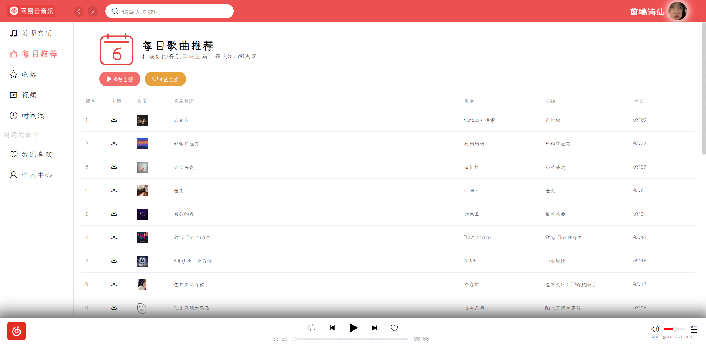
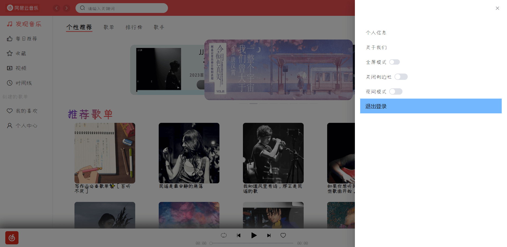

# 项目名称：网易云音乐 [在线预览地址](http://xiangyang.web3v.work/)

# 项目介绍
> 仿PC端网易云音乐桌面端，目前实现了页面基本样式，播放，歌词，歌单，专辑，歌手，视频，下载，搜索，登录，收藏，查看评论等基础功能
## 技术栈
- 前端：Vue3 + VueRouter + Pinia + Axios + ElementPlus + Sass + Es6
- 后端：node + express [网易云音乐NodeJs版 API](https://binaryify.github.io/NeteaseCloudMusicApi/#/)
> API：一个开源的[网易云音乐NodeJs版 API](https://binaryify.github.io/NeteaseCloudMusicApi/#/)（有 api 才有动力写。哈哈哈！！！）


# 安装与使用（FrontEnd）
> 将项目拉取到本地
``` bash
git clone https://gitee.com/xiangyang666/cloud-music.git
```
> 进入到项目
``` bash
cd ./cloud-music
```
> 安装依赖
``` bash
npm install 或 npm i

// 安装依赖时如果出现了依赖版本问题（如下命令即可解决）
npm install --legacy-peer-deps
```
> 启动项目
``` bash
npm run dev
```
> 打包
``` bash
npm run build
```

# 安装与使用（BackEnd）
> 将后端项目拉取到本地
``` bash
git clone https://github.com/Binaryify/NeteaseCloudMusicApi.git
```
> 进入到项目
``` bash
cd ./NeteaseCloudMusicApi
```
> 安装依赖
``` bash
npm install 或 npm i
```
> 启动项目（默认服务端地址为：http://localhost:3000）
``` bash
node app.js
```


# 项目服务器
**在此感谢 [CodeMan](https://gitee.com/PengGeee) 大佬提供的后台服务器**

# 效果显示






